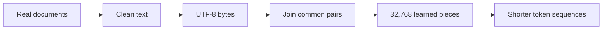
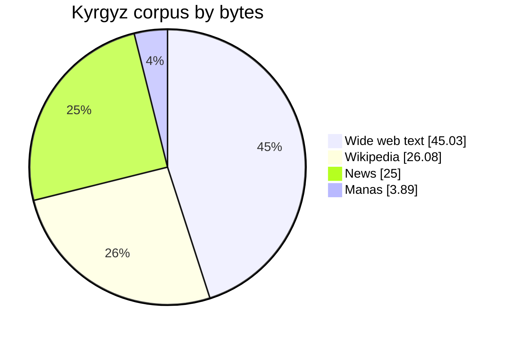

# Kyrgyz Tokenizer

A hands-on experiment in building a good tokenizer for Kyrgyz from the ground up.

The original goal was simple: understand the whole process by doing it myself. I collected a real Kyrgyz corpus, built the training pipeline, implemented the core byte-pair merging logic, and trained a 32,768-token byte-level BPE tokenizer.

The first version learned only from Kyrgyz. Later tests revealed something I had not planned for: real documents in Kyrgyzstan often mix Kyrgyz and Russian, while the Kyrgyz-only tokenizer made Russian text unnecessarily long. That discovery led to a second, bilingual version.

The final tokenizer keeps 99.25% of the Kyrgyz compression of the first version, improves Russian compression by 35.33%, and improves mixed Kyrgyz-Russian documents by 9.64%.

## What is a tokenizer?

A language model does not read text directly. A tokenizer first cuts text into pieces and replaces every piece with a number.

```text
"Кыргыз тили"

text -> pieces -> token IDs -> language model
```

If the pieces fit the language well, one sentence needs fewer tokens. If they fit badly, the same sentence breaks into many tiny fragments.

This project uses byte-level BPE:

1. UTF-8 turns text into bytes.
2. The tokenizer counts which neighboring pieces appear together often.
3. It joins the most common pair into a new token.
4. It repeats until the vocabulary reaches the chosen size.

The tokenizer begins with all 256 possible byte values. Because of that, it can encode any valid UTF-8 text without an unknown token.



## The corpus

The Kyrgyz training corpus contains 188,208 documents and a little over 524 million UTF-8 bytes.

It combines four kinds of text so the tokenizer does not learn from one narrow source.



The pipeline removes broken pages, checks the language, and removes exact and near copies. It found and removed 18,777 near-duplicate documents.

The raw corpus is not stored in Git. The sources have different licenses, so the repository keeps the code, source records, decisions, and final tokenizer without republishing all of the text.

## Why add Russian?

The first version learned only from Kyrgyz. It handled Kyrgyz well, but ordinary Russian sentences needed too many tokens.

That is a poor fit for real documents in Kyrgyzstan, where both languages often appear on the same page.

I trained 24 controlled candidates. They used different amounts of Russian text, two ways of separating text before BPE, and vocabulary sizes of 32K, 40K, and 50K.

I expected the best mix to need 20% Russian. The result was better: 10% Russian was already enough.

The final choice uses:

| Choice | Value |
| --- | --- |
| Vocabulary | 32,768 tokens |
| Training mix | 90% Kyrgyz, 10% Russian |
| Algorithm | Category-aware byte-level BPE |
| Unknown token | Not needed |
| Special or chat tokens | None |

## Results

Higher bytes/token means one token carries more text, so the sequence is shorter.

| Text | Kyrgyz-only v1 | Bilingual v2 | Result |
| --- | ---: | ---: | --- |
| Kyrgyz | 8.983 | 8.916 | 99.25% of the original result kept |
| Russian | 4.786 | 6.477 | 35.33% better |
| Mixed documents | 6.505 | 7.132 | 9.64% better |

On 21 real held-out documents containing both languages, 20 became shorter. One became longer by a single token. Every evaluated record decoded back into exactly the same text.

These numbers show how compactly the tokenizer splits the tested text.

## Try it

You need Python 3.12 or 3.13 and [`uv`](https://docs.astral.sh/uv/).

```bash
git clone https://github.com/nik1t7n/kyrgyz-tokenizer.git
cd kyrgyz-tokenizer
uv sync --locked

uv run kyrgyz-tokenizer inspect \
  --model models/kyrgyz-russian-byte-bpe-v2/tokenizer.json \
  --text "Кыргыз тили жана русский язык"
```

Or load the tokenizer directly:

```python
from tokenizers import Tokenizer

tokenizer = Tokenizer.from_file(
    "models/kyrgyz-russian-byte-bpe-v2/tokenizer.json"
)

text = "Кыргызстанда кыргызча жана по-русски сүйлөшөт."
ids = tokenizer.encode(text, add_special_tokens=False).ids

assert tokenizer.decode(ids) == text
print(ids)
```

The tokenizer does not include BOS, EOS, padding, or chat markers.

## Where things live

```text
configs/   settings for corpus and tokenizer runs
docs/      research, decisions, and full reports
models/    the saved v1 and v2 tokenizer files
src/       corpus and tokenizer code
```

The main artifact is [`models/kyrgyz-russian-byte-bpe-v2/tokenizer.json`](models/kyrgyz-russian-byte-bpe-v2/tokenizer.json).

If you want the full technical story, start with:

- [How the tokenizer experiment was designed](docs/experiments/TOKENIZER_V2_PLAN.md)
- [What the tokenizer results mean](docs/reports/TOKENIZER_V2_EVALUATION.md)
- [How the Kyrgyz corpus was built](docs/reports/CORPUS_V1_BUILD_REPORT.md)
- [What was found during the corpus audit](docs/reports/CORPUS_V1_QUALITY_AUDIT.md)
- [The project architecture](docs/ARCHITECTURE.md)

## Limits

- The mixed test set has 21 real documents, mostly formal writing rather than chat.
- English and code can be encoded, but the tokenizer was not optimized for them.
- The corpus text is not redistributed.
- A public repository is not automatically open source. Read [LICENSE.md](LICENSE.md) and [the public release note](docs/PUBLIC_RELEASE.md) before reuse or redistribution.
